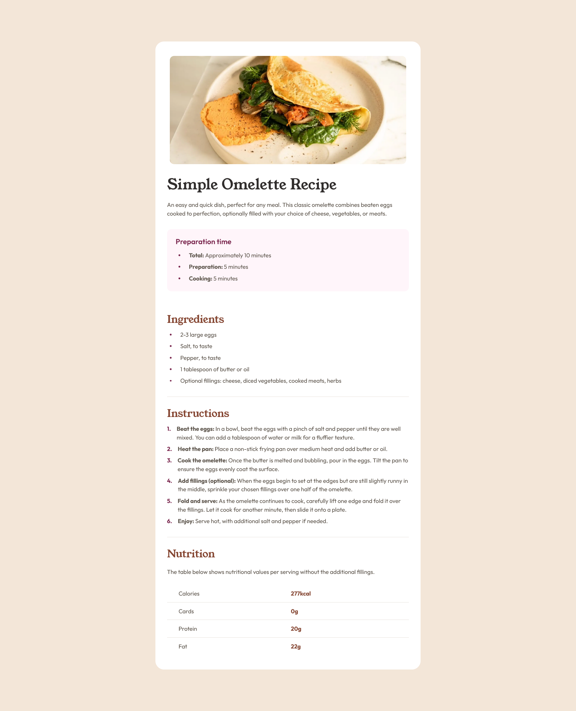

# Frontend Mentor - Recipe page solution

This is a solution to the [Recipe page challenge on Frontend Mentor](https://www.frontendmentor.io/challenges/recipe-page-KiTsR8QQKm). Frontend Mentor challenges help you improve your coding skills by building realistic projects.

## Table of contents

- [Overview](#overview)
  - [Screenshot](#screenshot)
  - [Links](#links)
- [My process](#my-process)
  - [Built with](#built-with)
- [Author](#author)

## Overview

### Screenshot

#### Desktop View

#### Mobile View

### Links

- Solution URL: [ /saurav-verma-01/Recipe-Landing-Page ](https://github.com/saurav-verma-01/Recipe-Landing-Page)
- Live Site URL: [https://recipe-landing-page-sv.netlify.app/](https://recipe-landing-page-sv.netlify.app/)

## My process

### Built with

- Semantic HTML5 markup
- CSS custom properties
- Flexbox
- Mobile-first workflow

## Author

- Linkedin - [Saurav Kumar Verma](https://www.linkedin.com/in/saurav-dev/)
- Github - [Saurav Kumar Verma](https://github.com/saurav-verma-01)
- Frontend Mentor - [@Saurav-98](https://www.frontendmentor.io/profile/Saurav-98)
- Twitter - [@SauravKverma22](https://twitter.com/SauravKverma22)
